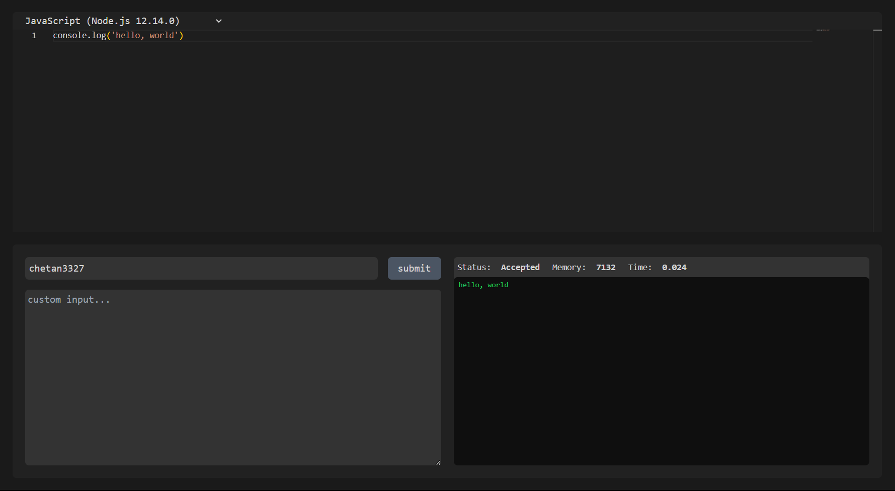

<!-- ABOUT THE PROJECT -->
# TUF (SDE Intern) Hiring Task


This Project is a web application given as a task in TUF (SDE Intern) Hiring.
I had to implement mainly two pages:

1. Code submission page: used mainly monaco editor and judge0 api for code compilation.
2. All submissions page: displays submissions of all users in a tabular format.

Use the `README.md` to get started.

<!-- BUILT WITH -->
# Built With

The Tech Stacks used are:

<div align="center">
  <a href="https://skillicons.dev">
      
  </a>
</div>

## Installation

1. Clone the repository to your local machine:

   ```bash
   git clone https://github.com/Chetan3327/takeuforward.git
   ```
2. Navigate to the frontend directory:

   ```bash
   cd client
   ```
3. Install dependencies:

   ```bash
   npm install
   ```
4. Navigate to the backend directory:

   ```bash
   cd server
   ```
5. Install dependencies:

   ```bash
   npm install
   ```

<!-- CONTACT -->
# Contact

<ul>
    <li>Name: Chetan Chauhan - chauhanchetan12789@gmail.com</li>
    <li>Linkedin: https://www.linkedin.com/in/chetan-chauhan-860106258/</li>
    <li>Project Link: https://takeuforward-one.vercel.app/</li>
</ul>